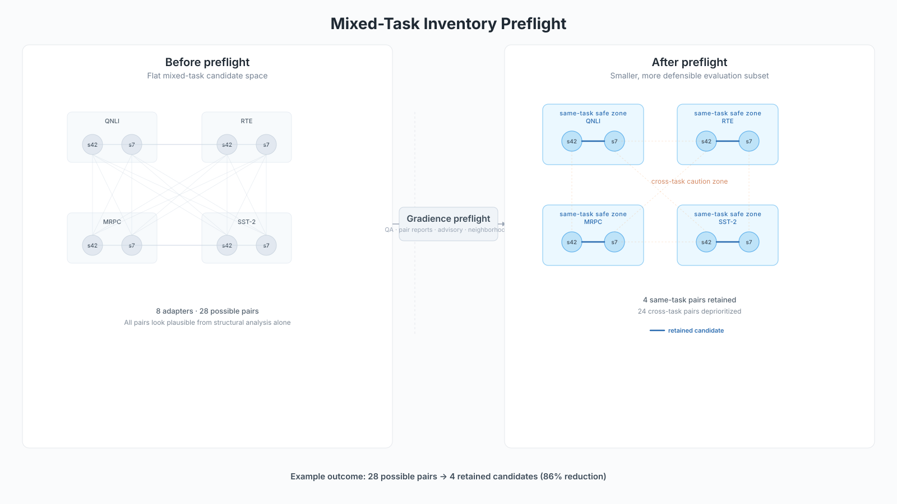

# Gradience

**Inventory preflight for LoRA adapter merging.** Reduce the search space, expose task-boundary risk, and turn a mixed adapter inventory into a smaller, more defensible evaluation plan -- before expensive merge testing begins.

> If you use Gradience in your research, please cite:
>
> ```bibtex
> @software{gradience2026,
>   title = {Gradience: Spectral Analysis of Low-Rank Adaptation Dynamics},
>   author = {Nanney, John T.},
>   year = {2026},
>   url = {https://github.com/johntnanney/gradience},
>   note = {Version 0.11.0}
> }
> ```

## What Gradience does



Given a pool of LoRA adapters you might want to merge, Gradience runs a preflight pass that:

1. **Screens source quality** -- identifies weak, under-evidenced, or ineligible adapters before they contaminate pairwise analysis
2. **Assesses pairwise structural compatibility** -- per-layer spectral analysis with risk levels, dominant issues, and strategy recommendations
3. **Detects task-boundary risk** -- flags cross-task pairs where structural similarity is misleading (validated across 132+ pairs, 0 false positives)
4. **Compresses the inventory** -- neighborhoods partition a dense pair matrix into same-task safe zones and cross-task caution zones
5. **Reduces the search space** -- in utility testing across 60 pairs and 5 inventories, the workflow eliminated 65-90% of candidate pairs in mixed-task pools before any behavioral evaluation

## Who it's for

- **Practitioners managing adapter inventories** -- Run preflight before merge experiments to avoid wasting evaluation budget on pairs that will fail
- **ML researchers studying merge behavior** -- Use spectral and task-boundary signals to understand why some merges work and others don't
- **Teams with mixed-task adapter pools** -- Partition inventories into actionable regions before committing to expensive downstream evaluation

## Start here

| I want to... | Go to |
|--------------|-------|
| Run my first inventory preflight | **[Playbook](docs/playbook.md)** — step-by-step for the five most common workflows |
| See what each scenario looks like | **[Example Gallery](docs/example-gallery.md)** — same-task, mixed-task, weak-evidence, near-miss |
| Understand the conceptual framework | **[Inventory Preflight Workflow](docs/inventory-preflight.md)** — when to use, how to interpret |
| Look up a specific command | **[CLI Reference](docs/cli.md)** — every flag and option |
| Walk through a worked example | **[Mixed-Task Walkthrough](docs/examples/mixed-task-inventory-walkthrough.md)** — 15 pairs → 2 |
| Set up behavioral evidence for hub adapters | **[Playbook §2: Evidence Bootstrap](docs/playbook.md#2-using-the-evidence-bootstrap)** |
| Compare runs or build a portfolio view | **[Playbook §5: Portfolio View](docs/playbook.md#5-using-the-portfolio-view-across-inventories)** |
| Understand the schema contracts | [Adapter QA](docs/adapter-qa-artifact.md) · [Merge Report](docs/merge-risk-report.md) · [Inventory Summary](docs/inventory-summary.md) |

## What you get

- **Source QA** -- Structural eligibility screening with machine-readable artifacts (`gradience.adapter_qa/v1`)
- **Merge-risk reports** -- Pairwise compatibility analysis with task-relationship advisories (`gradience.merge_qa_report/v1`)
- **Inventory summary** -- Aggregated view across adapters and pairs (`gradience.inventory_summary/v1`)
- **Neighborhoods** -- Rule-based inventory grouping that compresses pair matrices into interpretable regions
- **Spectral measurements** -- Per-layer SVD analysis yielding stable rank, energy concentration, utilization ratios, and rank waste quantification
- **Training telemetry** -- Structured JSONL recording of spectral evolution across training steps
- **Merge compatibility analysis** -- Principal angle and directional agreement measurements between adapter pairs, with per-layer geometric characterization
- **Reproducible experimental infrastructure** -- Multi-seed benchmarking with statistical aggregation, tolerance-based validation, and automated candidate generation

## Install

### Quick Install
```bash
# Core package -- includes torch + safetensors (spectral analysis, merge analysis)
pip install gradience

# Full experimental suite -- adds transformers, datasets, peft
pip install "gradience[bench]"

# Development tools
pip install "gradience[dev]"
```

### PyTorch Variant Selection (Optional)

`pip install gradience` auto-installs a default PyTorch build. To use a specific variant (CPU-only or a particular CUDA version), install PyTorch **before** Gradience:

```bash
# CPU-only (smaller download)
pip install torch --index-url https://download.pytorch.org/whl/cpu
pip install gradience

# CUDA 12.1
pip install torch --index-url https://download.pytorch.org/whl/cu121
pip install gradience
```

**Common issue**: If you see `ModuleNotFoundError: No module named 'datasets'` or `'transformers'`, you need the bench extras. **Fix**: `pip install "gradience[bench]"`

**[Complete Installation Guide](https://github.com/johntnanney/gradience/blob/main/docs/install.md)** -- GPU setup, RunPod, troubleshooting, cache configuration

## Verify installation (10 seconds)

```bash
# Install base package (lightweight)
pip install gradience

# Test basic functionality - no ML dependencies needed
gradience --help                # < 3 seconds
gradience audit --help          # Show audit command options
gradience --version             # Confirm installation

# Test with sample data (no training required)
python -c "
import gradience
print(f'Gradience {gradience.__version__} installed successfully')
print('Base package ready for spectral analysis workflows')

# Test JSON parsing (works with any audit.json file)
import json
sample_audit = {
    'audit_timestamp': '2026-02-06T10:30:00.000000',
    'probe_rank': 16,
    'summary': {
        'stable_rank_mean': 2.27,
        'utilization_mean': 0.142,
        'energy_rank_90_p50': 8.0
    }
}
print('Sample audit data parsed successfully')
print(f'   Mean stable rank: {sample_audit[\"summary\"][\"stable_rank_mean\"]}')
print(f'   Rank utilization: {sample_audit[\"summary\"][\"utilization_mean\"]:.1%}')
"
```

**Zero drama**: These commands work immediately after `pip install gradience` with no additional setup.

## Quickstart: reproduce a spectral analysis in 60 seconds

```bash
# Install with ML dependencies
pip install "gradience[bench]"

# List available experiment configs (included in package)
python -c "
import importlib.resources
configs = importlib.resources.files('gradience.bench.configs')
print('Available configs:')
for f in sorted(configs.iterdir()):
    if f.name.endswith('.yaml'):
        print(f'  {f.name}')
"

# Copy and run a fast CPU experiment (~60 seconds)
python -c "
import importlib.resources, shutil
configs = importlib.resources.files('gradience.bench.configs')
shutil.copy(configs / 'distilbert_sst2_ci.yaml', './cpu_test.yaml')
print('Config copied to cpu_test.yaml')
"

gradience-bench --config cpu_test.yaml --output results/

# Examine results
cat results/bench.json  # Spectral measurements + validation results
cat results/audit.json  # Per-layer spectral analysis
```

**Performance expectations**: First run ~60-90s (model download + training), subsequent runs ~30s (cached).

## Preflight artifacts

The standard preflight workflow produces machine-readable QA and risk artifacts:

- **`*_qa.json`** -- Adapter QA artifact (`gradience.adapter_qa/v1`): structural summary, eligibility status, behavioral evidence
- **`*_report.json`** -- Merge risk report (`gradience.merge_qa_report/v1`): pairwise risk level, recommended strategy, dominant issue
- **`inventory_summary.json`** -- Inventory summary (`gradience.inventory_summary/v1`): aggregated counts across adapters and pairs

## Experimental artifacts

Benchmark runs produce additional experimental records:

- **`audit.json`** -- Per-layer spectral decomposition: stable rank, energy concentration, utilization ratios, rank waste
- **`bench.json`** -- Full validation results with per-seed metrics and statistical comparisons
- **`bench.md`** -- Human-readable summary of findings
- **`bench_aggregate.json`** -- Multi-seed statistical aggregation (mean, std, confidence intervals, effect sizes)
- **`merge_audit.json`** -- Per-layer geometric compatibility between two adapters (principal angles, directional agreement, magnitude balance)
- **`merge_audit.md`** -- Human-readable merge compatibility report with per-layer characterization

## Core commands

```bash
# Measure spectral structure of an existing LoRA adapter
gradience audit --peft-dir /path/to/adapter --json

# Record training telemetry
gradience monitor training_run.jsonl --verbose

# Analyze per-layer rank utilization
gradience audit --peft-dir /path/to/adapter --suggest-per-layer

# Measure geometric compatibility between two adapters
gradience merge-audit --adapter-a ./adapter_a --adapter-b ./adapter_b --output-dir ./merge_out

# Run a complete experimental protocol
gradience-bench --config config.yaml --output results/

# Validate config before running
gradience check --peft adapter_config.json --training training_args.json
```

## Experimental methodology

Gradience implements a four-stage experimental protocol for studying rank structure in LoRA adapters:

1. **Probe** -- Train a high-rank adapter (r=16 or higher) to establish an unconstrained baseline.
   This captures the full spectral structure the task can express before any dimensionality constraints are imposed.

2. **Measure** -- Decompose each adapter weight matrix via SVD. Extract stable rank,
   energy concentration at the 90th percentile, and per-layer utilization ratios.
   A layer using 2 of 16 available rank dimensions reveals that the learned transformation
   is intrinsically low-dimensional for that layer.

3. **Derive** -- Generate rank configurations from the spectral measurements. Multiple
   derivation policies (energy-based, knee detection, uniform) each map metrics to
   per-layer rank settings differently, producing a family of configurations
   to test rather than a single point estimate.

4. **Validate** -- Train each derived configuration with multiple seeds (3+) and compare
   against the probe baseline using a tolerance threshold (e.g., 2% accuracy loss).
   Configurations where all seeds pass are Tier A (statistically reliable).
   Configurations where 2 of 3 seeds pass are Tier B (suggestive but not conclusive).
   Multi-seed validation separates genuine spectral findings from initialization artifacts.

The result is a set of rank configurations with statistical evidence linking spectral
measurements to downstream performance.

## Key concepts

- **Probe adapter** -- High-rank (r=16+) baseline capturing unconstrained spectral structure
- **Spectral audit** -- SVD-based measurement of stable rank, utilization, and energy distribution per layer
- **Candidate derivation** -- Mapping spectral measurements to rank configurations via multiple policies
- **Validation protocol** -- Multi-seed comparison against probe baseline with tolerance thresholds and effect sizes
- **Merge audit** -- Geometric compatibility analysis between adapter pairs via principal angles, directional agreement, and magnitude balance -- characterizes each layer as aligned, redundant, conflicting, or imbalanced

**[Complete documentation](https://github.com/johntnanney/gradience/tree/main/docs/)** | **[API reference](https://github.com/johntnanney/gradience/blob/main/PUBLIC_API.md)** | **[Artifacts & Evidence](https://github.com/johntnanney/gradience/blob/main/docs/artifacts.md)**

## Integration with HuggingFace Transformers

Instrument your training loop with one line to capture spectral telemetry:

```python
from transformers import Trainer
from gradience.vnext.integrations.hf import GradienceCallback

trainer = Trainer(..., callbacks=[GradienceCallback()])
trainer.train()

# Telemetry saved to: <output_dir>/run.jsonl
```

Then analyze the recorded data:

```bash
# Quick overview of training dynamics
gradience monitor output/run.jsonl

# Detailed spectral analysis
gradience monitor output/run.jsonl --verbose

# Measure the resulting adapter
gradience audit --peft-dir output/adapter --layers --json
```

## Default workflow: preflight QA

The standard Gradience workflow screens adapters and merge pairs before deployment:

```bash
# 1. Audit each adapter
gradience audit-adapter --peft-dir ./adapter_a --out qa/adapter_a_qa.json
gradience audit-adapter --peft-dir ./adapter_b --out qa/adapter_b_qa.json

# 2. Assess merge risk (with source QA context)
gradience merge-audit --adapter-a ./adapter_a --adapter-b ./adapter_b \
    --source-a-qa qa/adapter_a_qa.json --source-b-qa qa/adapter_b_qa.json \
    --emit-report reports/ab_report.json

# 3. Aggregate inventory
gradience summarize-inventory --qa-dir qa/ --report-dir reports/ \
    --emit-report inventory/summary.json

# 4. Gate on quality (optional strict mode)
gradience merge-audit --adapter-a ./adapter_a --adapter-b ./adapter_b \
    --source-a-qa qa/adapter_a_qa.json --source-b-qa qa/adapter_b_qa.json --strict-qa
```

See **[Getting Started: Preflight](https://github.com/johntnanney/gradience/blob/main/docs/getting-started-preflight.md)** for the full walkthrough and **[Source QA Workflow](https://github.com/johntnanney/gradience/blob/main/docs/source_qa_workflow.md)** for interpretation examples.

Optional diagnostic extensions (advanced, not part of the default workflow):

```bash
# Optional shared-basis diagnostic in merge report output
gradience merge-audit --adapter-a ./adapter_a --adapter-b ./adapter_b \
    --compute-core-space --emit-report reports/ab_report_with_core_space.json

# Optional rule-based inventory neighborhood suggestion
gradience suggest-neighborhoods --qa-dir qa/ --report-dir reports/ \
    --emit-report inventory/neighborhoods.json
```

On small encoder models, **task identity is the key regime boundary** for merge safety. Same-task pairs are broadly safe — confirmed across 45 pairs and 3 blind-spot studies with 0 material degradations. Cross-task pairs are where meaningful failure modes appear.

Merge reports include a **task-relationship advisory** when source QA artifacts indicate different evaluation tasks. This is part of the stable interpretive layer, addressing the main cross-task blind spot where structural pair-risk alone is insufficient. Tested across 132+ pairs on two backbones with zero false positives. In mixed-task inventories, it partitions the pair matrix into same-task safe zones and cross-task caution zones. It does not alter structural risk classification. See [Merge Risk Report](https://github.com/johntnanney/gradience/blob/main/docs/merge-risk-report.md) for details.

## Experimental workflow

For research into spectral training dynamics:

```bash
# 1. Train with telemetry (or use existing adapter)
python your_training_script.py  # with GradienceCallback

# 2. Inspect training dynamics
gradience monitor output/run.jsonl

# 3. Measure spectral structure
gradience audit --peft-dir output/adapter --suggest-per-layer

# 4. Run experimental protocol (derive candidates + validate with multiple seeds)
gradience-bench --config my_config.yaml --output experiment_results/

# 5. Examine statistical evidence
cat experiment_results/bench_aggregate.json
```

## Configuration

Experiment configs specify model, task, and validation criteria:

```yaml
model:
  name_or_path: "distilbert-base-uncased"

task:
  name: "sst2"
  type: "classification"

lora:
  r: 16              # Probe rank
  target_modules: ["q_lin", "v_lin"]

runtime:
  device: "auto"
  seed: [42, 43, 45]  # Multi-seed validation
```

See **[Configuration Reference](https://github.com/johntnanney/gradience/blob/main/docs/configs.md)** for the full schema including experimental options.

## Requirements

- **Python 3.10+**
- **PyTorch** and **safetensors** (auto-installed with `pip install gradience`)
- **Optional**: transformers, peft, datasets (for benchmarking via `pip install "gradience[bench]"`)

## Performance

- **CLI help**: < 3 seconds (no ML dependencies loaded)
- **Base install**: < 10MB (minimal dependencies)
- **CPU-only operation**: Full functionality without GPU requirements

## What we test in CI

Every release is validated with comprehensive CI gates:

- **Package integrity**: Base install, bench extras, and console scripts work correctly across Python 3.10-3.12
- **Performance guarantees**: CLI help commands complete within documented timing requirements
- **PyPI readiness**: Wheel contents, config accessibility via importlib.resources, and quickstart functionality

**[Complete CI test matrix](https://github.com/johntnanney/gradience/blob/main/.github/workflows/pip-install-ready.yml)** -- See exactly what we validate before each release
**[CI Gates documentation](https://github.com/johntnanney/gradience/blob/main/CI_GATES.md)** -- Detailed testing requirements and performance targets

## What Gradience is

Gradience is an **inventory preflight system** for LoRA adapter merging:

- **A search-space reducer** -- In mixed-task inventories, it typically eliminates 65-90% of candidate pairs before evaluation begins (81% average where the advisory is the main discriminator)
- **A task-boundary detector** -- It partitions inventories into same-task safe zones and cross-task caution zones using validated metadata signals (0 false positives across 132+ pairs, 2 backbones)
- **A structural screening tool** -- It audits individual adapters for spectral health and screens merge pairs for geometric compatibility
- **A merge-risk reporting system** -- It produces machine-readable risk artifacts with per-layer verdicts, strategy recommendations, and strict-QA gating
- **A companion to your evaluation stack** -- It reduces what you need to evaluate; it does not replace your evaluation pipeline

### What is established

- Source QA as the first decision anchor
- Pair-risk as the default structural layer
- Task-relationship advisory as stable interpretive infrastructure (cross-task boundary detection)
- Neighborhoods as inventory compression for pools of 6+ adapters
- Same-task safety on small encoder models (49 pairs, 0 material degradations)

### What is open research

- Cross-task severity grading (no signal reliably predicts severity within cross-task pairs across backbones)
- Extension to larger models and decoder-only architectures

## API Stability

**Stable interfaces** (backwards compatible):
- CLI commands (`gradience audit-adapter`, `gradience merge-audit`, `gradience summarize-inventory`, `gradience-bench`, etc.)
- Frozen artifact schemas: `gradience.adapter_qa/v1`, `gradience.merge_qa_report/v1`, `gradience.inventory_summary/v1`
- Python API: `gradience.api.audit_adapter()`, `gradience.api.merge_risk_report()`, `gradience.api.summarize_inventory()`
- Config schema (YAML structure)
- Output artifacts (`audit.json`, `bench.json`, `bench.md`, `merge_audit.json`, `merge_audit.md`)

**Advanced optional wrappers**:
- `gradience.api.compute_core_space_diagnostic()` (diagnostic-only pair extension)
- `gradience.api.suggest_neighborhoods()` (inventory workflow extension)

**Experimental features** (including spectral compression) are clearly marked and may change.

## Examples

- **[Example Gallery](docs/example-gallery.md)** -- Five curated scenarios covering same-task, mixed-task, weak-evidence, and near-miss inventories
- **[Mixed-task inventory walkthrough](docs/examples/mixed-task-inventory-walkthrough.md)** -- Flagship: 6 adapters, 4 tasks, 15 pairs → 2 (87% reduction)
- **[Same-task control walkthrough](docs/examples/same-task-control-walkthrough.md)** -- Contrast case: advisory silence, confirmatory workflow
- **[Curated demo bundle](examples/demo/)** -- Complete preflight artifacts: eligible, weak, and missing-QA adapters
- **[Fixture inventories](examples/inventories/)** -- Named inventories with expected neighborhood outcomes
- **[Minimal integration](examples/vnext/toy_lora_run.py)** -- Add telemetry to any training script
- **[HF Trainer integration](examples/vnext/hf_trainer_example.py)** -- End-to-end training with spectral telemetry
- **[Experiment configs](examples/configs/)** -- Define experimental protocols

## Documentation

### Getting started

- **[Playbook](docs/playbook.md)** -- Step-by-step guide for the five most common workflows (start here)
- **[Example Gallery](docs/example-gallery.md)** -- Five curated scenarios: same-task, mixed-task, large, weak-evidence, near-miss
- **[Getting Started: Preflight](docs/getting-started-preflight.md)** -- Minimal walkthrough producing all three artifact types
- **[Installation Guide](docs/install.md)** -- Complete setup guide with troubleshooting

### Workflow and interpretation

- **[Inventory Preflight Workflow](docs/inventory-preflight.md)** -- Conceptual framework: when to use, how to interpret
- **[Source QA Workflow](docs/source_qa_workflow.md)** -- Assess adapter quality before merging
- **[Advanced Workflows](docs/advanced-workflows.md)** -- Optional diagnostics and inventory workflows

### Walkthroughs

- **[Mixed-Task Inventory Walkthrough](docs/examples/mixed-task-inventory-walkthrough.md)** -- Flagship: 6 adapters, 15 pairs → 2
- **[Same-Task Control Walkthrough](docs/examples/same-task-control-walkthrough.md)** -- Confirmatory: advisory silence, clean inventory

### Schema and API

- **[Adapter QA Artifact](docs/adapter-qa-artifact.md)** -- `gradience.adapter_qa/v1` schema contract
- **[Merge Risk Report](docs/merge-risk-report.md)** -- `gradience.merge_qa_report/v1` schema contract
- **[Inventory Summary](docs/inventory-summary.md)** -- `gradience.inventory_summary/v1` schema contract
- **[CLI Reference](docs/cli.md)** -- Complete command-line reference and examples
- **[Configuration Reference](docs/configs.md)** -- YAML config schema and examples
- **[API Stability](docs/api_stability.md)** -- What is stable, what may change

### Research and theory

- **[Theoretical Foundations](docs/THEORY.md)** -- Mathematical framework and open questions
- **[Empirical Findings](docs/FINDINGS.md)** -- Results obtained with Gradience
- **[Research Roadmap](docs/ROADMAP.md)** -- Open questions and planned investigations
- **[Experiment Guide](docs/USER_MANUAL.md)** -- Designing and running spectral studies
- **[Statistical Methodology](docs/VALIDATION_POLICY.md)** -- Validation rigor requirements

### Reference

- **[Spectral Analysis Policies](docs/RANK_POLICIES_GUIDE.md)** -- Interpretive guide for rank metrics
- **[Core-Space Audit](docs/core-space-audit.md)** -- Optional shared-basis diagnostic for pair audits
- **[Merge Neighborhoods](docs/merge-neighborhoods.md)** -- Optional rule-based inventory grouping aid
- **[Artifacts & Evidence](docs/artifacts.md)** -- Understanding experimental outputs
- **[Troubleshooting](docs/troubleshooting.md)** -- Common issues and solutions

## License

Licensed under the Apache License, Version 2.0. See [LICENSE](https://github.com/johntnanney/gradience/blob/main/LICENSE) for details.

## Citation

**APA Style:** Nanney, J. T. (2026). *Gradience: Spectral analysis of low-rank adaptation dynamics* (Version 0.11.0) [Computer software]. https://github.com/johntnanney/gradience

**Note for maintainers:** Update version numbers in citation when releasing new versions. Current version should match `pyproject.toml`.

## Changelog

See [CHANGELOG.md](https://github.com/johntnanney/gradience/blob/main/CHANGELOG.md) for version history and [GitHub Releases](https://github.com/johntnanney/gradience/releases) for detailed release notes.

## Security & Responsible Use

Gradience is designed for research into the spectral structure of fine-tuned language models. Users should:

- **Validate findings**: Always verify spectral measurements against downstream task metrics
- **Resource awareness**: Monitor compute and storage usage, especially in cloud environments
- **Data privacy**: Ensure compliance with data handling requirements for your datasets
- **Model licensing**: Respect licensing terms of base models and datasets used

For security issues, please see our [security policy](https://github.com/johntnanney/gradience/blob/main/SECURITY.md).
