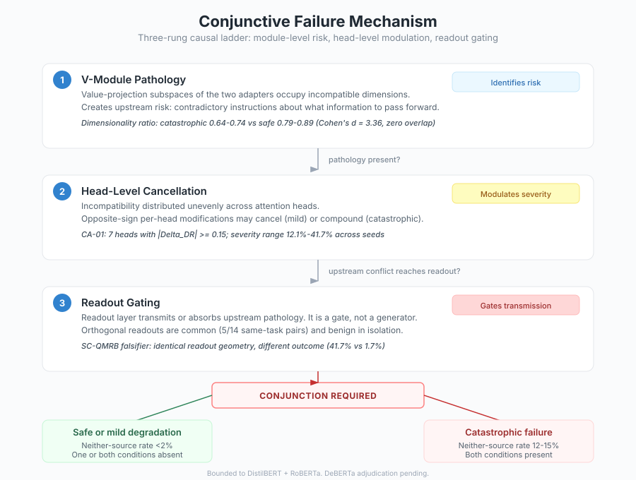
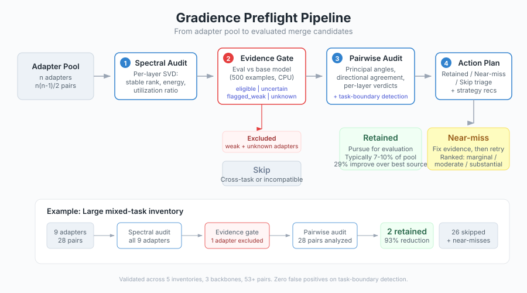

# Spectral Triage for LoRA Adapter Merging: Mechanism, Workflow, and Bounded Validation

**John T. Nanney**
**Gradience v1.0.1 — April 2026**

> **Abstract.** Merging independently fine-tuned LoRA adapters promises to combine capabilities without retraining, but most candidate pairs fail, and discovering failures requires expensive behavioral evaluation. This report presents Gradience, a spectral-geometric triage system that narrows the merge search space before evaluation begins. Across 5 field trial inventories on small encoder models (DistilBERT, BERT-base, RoBERTa), the system eliminates 90–93% of candidate pairs while retaining the correct first choices, with zero false positives on task-boundary detection (53+ pairs, 3 backbones). The triage signal derives from SVD-based analysis of adapter weight matrices: principal angles and singular value structure reveal structural compatibility *a priori*. A mechanistic investigation identifies the specific geometric conditions for catastrophic failure — conjunctive V-module dimensionality mismatch and readout incompatibility — arrived at by systematically eliminating five simpler hypotheses. The approach is currently bounded to small encoders on classification tasks with LoRA rank ≤ 16; a completed decoder-only ecosystem census (n=36, 3 architecture families) finds real but confound-sensitive architecture-task structure and is best interpreted as an ecological precursor to controlled GPU studies. Throughout, we maintain explicit boundaries on what the evidence supports, what is suggestive, and what remains open.

---

## 1. Introduction: The Merge Triage Problem

The LoRA (Low-Rank Adaptation) paradigm has made fine-tuning large language models practical: rather than updating all parameters, one trains a pair of low-rank matrices whose product approximates the full weight update. The result is a small, portable *adapter* that can be stored, shared, and — in principle — merged with other adapters to combine capabilities.

The promise of adapter merging is substantial. If you have adapters fine-tuned for sentiment analysis, topic classification, and irony detection, merging them could in principle yield a single model with multiple retained capabilities — though in practice such merges often fail, and the failures are difficult to predict without evaluation. Several merge strategies exist — linear interpolation, TIES (trim, elect sign, merge), DARE (dropout and rescale), and others — but no strategy eliminates the need to determine which pairs are worth attempting in the first place.

The problem is that merge failure is common, unpredictable, and expensive to detect. A merged model may lose one adapter's capability entirely, produce confident but wrong predictions on a new class of inputs, or degrade subtly in ways that only emerge during evaluation. The standard approach — merge and evaluate — scales quadratically in the number of adapters and requires behavioral evaluation (inference on held-out data) for every candidate pair. For a pool of 9 adapters, that is 36 pairs to evaluate. For 20 adapters, 190 pairs. Most of these evaluations will reveal that the merge failed, and that computational budget was wasted.

This report describes a different approach: *spectral triage*. By examining the singular value decomposition (SVD) of each adapter's weight matrices, we can extract geometric signatures — subspace orientations, energy concentrations, dimensional utilization ratios — that predict structural compatibility before any merge is attempted. The claim is not that spectral analysis can replace behavioral evaluation, but that it can *dramatically reduce the search space* so that evaluation is spent only on promising candidates.

Gradience is the system that implements this approach. Across 5 field trial inventories covering 3 backbone architectures (DistilBERT, BERT-base, RoBERTa-base), 4 task families, and 53+ adapter pairs with 16 fully evaluated merges, it eliminates 90–93% of candidate pairs while retaining the correct first choices. Task-boundary detection — identifying when two adapters target fundamentally different tasks and should not be merged — achieves zero false positives across the entire validation set.

But the interest of this work extends beyond the product. The research program behind Gradience has produced a mechanistic account of *why* adapter merges fail that is, to our knowledge, novel: catastrophic merge failure requires the conjunction of two independent geometric conditions — pathology in the V-module (value projection) subspace *and* incompatibility in the readout layer's decision geometry. Neither condition alone is sufficient. This conjunctive model was arrived at by systematically testing and eliminating simpler hypotheses, and it is supported by four independent evidence lines described in Section 3.

### Scope and Boundaries

This report describes work validated on small encoder models (DistilBERT, BERT-base, RoBERTa-base) performing classification tasks, with LoRA adapters of rank ≤ 16. These boundaries are not rhetorical hedges; they reflect the actual limits of the evidence base. The approach may generalize — preliminary census data from decoder-only models (Section 7) is suggestive — but we do not claim generality we have not demonstrated.

### Reading Guide

The report is structured to serve two audiences. **Practitioners** managing adapter inventories will find the core value proposition in Sections 1, 4, and 5, with practical workflow details. **Researchers** studying merge dynamics and spectral geometry will find the theoretical and mechanistic substance in Sections 2, 3, and 6. Section 7 (Open Frontiers) addresses both audiences with preliminary results and honest assessment of what remains unknown.

---

## 2. Why Spectral Geometry? A Conceptual Argument

The central claim of this work is that the singular value decomposition of LoRA weight matrices contains information about merge compatibility. This section explains *why* one should expect this to be true — not as a post-hoc rationalization of empirical findings, but as a principled argument from the structure of the problem.

### 2.1 What LoRA Matrices Encode

A LoRA adapter modifies a pre-trained weight matrix $W_0$ by adding a low-rank update $\Delta W = BA$, where $B \in \mathbb{R}^{d \times r}$ and $A \in \mathbb{R}^{r \times d}$ with $r \ll d$. The product $BA$ lives in a low-dimensional subspace of the full weight space. The SVD of $\Delta W$ decomposes this update into orthogonal directions (left and right singular vectors) weighted by magnitudes (singular values).

Each singular direction represents a direction in weight space along which the adapter has learned to modify the pre-trained model's behavior. The corresponding singular value represents how strongly the adapter pushes along that direction. The full collection of singular directions and values — the *spectral profile* — is a complete description of the adapter's learned modification to a particular weight matrix.

This is not merely a mathematical convenience. The spectral profile has a direct interpretation: it tells you *what dimensions of the representation space the adapter has learned to use, and how much it uses each one*. An adapter with a sharp spectral profile (one or two dominant singular values, the rest negligible) has learned a low-dimensional modification — it changes the model's behavior along a narrow subspace. An adapter with a flat spectral profile uses its full rank budget more evenly, modifying the model across many directions simultaneously.

### 2.2 Merging as Subspace Interaction

When two adapters are merged (by any strategy — linear combination, TIES, DARE), the result is a new weight update that combines the spectral content of both sources. The key geometric question is: *how do the learned subspaces of the two adapters relate to each other?*

Three idealized cases illuminate the space of possibilities.

**Orthogonal subspaces.** If Adapter A has learned to modify dimensions 1–4 and Adapter B has learned to modify dimensions 5–8, their modifications are independent. Merging them produces a combined update that preserves both adapters' contributions without interference. This is the best case for merging.

**Aligned subspaces.** If both adapters modify the same dimensions but in the same direction, the merge reinforces both. The merged adapter pushes harder along the shared directions. This can work well (if the shared direction serves both tasks) or produce an over-strong modification, but it rarely causes catastrophic failure.

**Conflicting subspaces.** If both adapters modify the same dimensions but in opposing directions, the merge produces cancellation. The merged adapter's effective modification along the contested dimensions is weakened or zeroed out. This is where catastrophic failures originate — the merge destroys information that one or both adapters needed.

The SVD provides exactly the mathematical apparatus to measure where on this spectrum a given adapter pair falls. The *principal angles* between the column spaces of $B_A$ and $B_B$ (and between the row spaces of $A_A$ and $A_B$) quantify subspace overlap. The *directional agreement* between corresponding singular vectors quantifies whether shared dimensions are used cooperatively or antagonistically. The *singular value magnitudes* determine how much energy is at stake in each interaction.

### 2.3 The Observable–Compatibility Link: A Formal Sketch

*The purpose of this subsection is not to derive a general merge theory, but to show that in the simplest case the key interaction term governing merge outcome is already a function of observable subspace geometry. The later mechanistic findings (Section 3) rest on empirical evidence, not on this sketch — but the sketch explains why the spectral approach was worth pursuing in the first place.*

For the rank-1 case, the connection between spectral observables and merge outcome can be made exact. Given two rank-1 adapters $\Delta W_a = \sigma_a u_a v_a^T$ and $\Delta W_b = \sigma_b u_b v_b^T$, the merged update $\Delta W_m = \alpha \Delta W_a + \beta \Delta W_b$ has leading singular value:

$$\sigma_1(\Delta W_m) = \sqrt{\frac{T + \sqrt{T^2 - 4D}}{2}}$$

where $T = a^2 + b^2 + 2abz$, with $a = |\alpha|\sigma_a$, $b = |\beta|\sigma_b$, and the *interaction term* $z = \text{sign}(\delta) \cdot \cos(\theta) \cdot \cos(\phi)$. Here $\theta$ is the principal angle between left singular vectors, $\phi$ is the principal angle between right singular vectors, and $\delta$ captures sign alignment. The residual term $D = a^2 b^2 (1 - \cos^2\theta)(1 - \cos^2\phi)$ is bounded by the sine product of the principal angles.

The critical observation is that the interaction term $z$ — which determines whether the merge amplifies, preserves, or destroys spectral content — is entirely a function of the *geometric relationship* between the two adapters' singular subspaces. The angles $\theta$ and $\phi$ are measurable from the SVD alone, without performing the merge. This is the formal basis for spectral triage: the quantities that govern merge outcome are observable *a priori*.

For general rank-$r$ adapters, exact expressions give way to bounds. The cross-term contribution to the merged spectrum is bounded by:

$$\sigma_1(\text{cross}) \leq 2\alpha\beta \sum_i s_{a,i} \, s_{b,i} \cos(\theta_i) \cos(\phi_i)$$

where $\theta_i$ and $\phi_i$ are the $i$-th principal angles between the respective subspaces. The bound is tight when the adapters' singular directions are well-aligned; it is loose when they interact across multiple dimensions. In practice, the spectral profiles of LoRA adapters on small encoders are sharply concentrated — 4 to 8 effective dimensions carry >90% of the Frobenius energy — so the rank-1 intuition extends well.

*Independent formal convergence.* The interaction term $z$ identified in this sketch — which arises from mixing the A and B matrices of two adapters — was independently derived and empirically validated by Akbar et al. (2025) at ICML. Working from a strategy-selection rather than a triage perspective, they formally prove that *direct merging* (combining A and B matrices separately) introduces an interfering cross-term that degrades performance, while *multiplied merging* (computing the full product BA before merging) exhibits linear mode connectivity in the loss landscape. The cross-term they identify is algebraically the same quantity as $z$ here. This convergence from an independent research program confirms that the interaction term governing merge outcome is the right object of theoretical attention — and that Gradience's triage is, in structural terms, detecting the pairs for which that term is most damaging before the merge is attempted.

### 2.3.1 Independent Training-Side Evidence for Spectral Partitioning

The formal sketch above shows that the interaction term governing merge outcome is weighted by singular value magnitudes — high-energy directions dominate the interaction, low-energy directions contribute little. This weighting is not accidental. Independent evidence from multi-task LoRA training suggests that the singular value spectrum partitions into functionally distinct bands during training itself.

Tian, Ledent, and Sun (2026) measure inter-task alignment of LoRA singular vectors across 16 instruction-following tasks on LLaMA-2-7B (Flan-v2→BBH). Using a singular-value-weighted cosine similarity metric across tasks' B-matrix decompositions, they find that the top-20% of the spectrum (by singular value magnitude) shows 89% inter-task alignment and concentrates 54% of total singular value mass, while the bottom-50% shows only 3% alignment. High-energy directions converge to a shared subspace across tasks; low-energy directions diverge to encode task-specific features.

This finding has a direct bearing on why spectral triage works. If high-SV directions are shared across tasks, then the principal angles between high-SV subspaces of same-task or same-family adapters should be small — precisely the geometric condition that the Gradience audit identifies as SAFE or REDUNDANT. Conversely, the large angles between low-SV subspaces contribute minimally to the interaction term because those directions carry little energy. The energy-weighted interaction bound above therefore naturally emphasizes the directions where compatibility matters most: the shared, high-energy directions where conflict would be catastrophic and agreement is common.

Three qualifications were originally necessary; the first has since been empirically addressed. First, Tian et al.'s alignment measurements come from multi-task *co-training* (shared gradient flow), not from independently trained adapters. We have now tested this directly on Gradience's independently trained adapter corpus using the Gavish-Donoho optimal hard threshold (Marchenko-Pastur bulk edge) as the partition point (see N127, `scripts/mp_partition_test.py`, `scripts/mp_partition_extensions.py`). The results confirm that spectral partitioning survives independent training: same-task adapter pairs show 7.8× higher SV-weighted alignment in the high-SV band than the low-SV band, and high-SV alignment rises monotonically during training (0.24 → 0.61 over steps 50–200, plateauing at step 150). Crucially, the partitioning is task-dependent: cross-task pairs show only 2.5× (t = 23.4, p ≈ 10⁻⁴⁶ for same-task vs cross-task high-SV alignment). The magnitude is weaker than mtLoRA's 30× co-training ratio, which is consistent with the absence of shared gradient flow, but the phenomenon is present and statistically robust. This constitutes a converging-operations argument: two independent methodological pipelines — training-side gradient analysis and post-hoc SVD-based audit — arrive at the same spectral partition. Second, their work operates on LLaMA-2-7B and ViT (decoder and vision architectures), while the N127 spectral partition experiments are on small encoders (DistilBERT-base). However, earlier Gradience research on Mistral-7B provides independent decoder-scale evidence: a merge study across chat, GSM8K, and code adapters (rank 8, 3 seeds, 27 cross-task + 9 same-task pairs) found same-task subspace overlap of 0.473 vs cross-task overlap of 0.200 — a 2.4× separation (t = 12.985, p < 0.0001) — and subspace overlap predicted merge dominance at r = 0.846 (Gradience Series Post 3). Additionally, spectral audits of public HuggingFace Hub adapters — first 29 adapters across 8 base models (Study 14), then expanded to 86 adapters across 22 architectures spanning 12 task categories (Post 7) — confirmed that the spectral metrics read genuine structure across decoder architectures. The expanded audit found mean utilization of 0.172 with median 50% compression potential, consistent across the full architecture range from Gemma-2B to Mistral-7B. The architecture qualification is therefore substantially weakened: the same-task/cross-task spectral separation has now been observed on both DistilBERT-base (N127: 7.8× SV-weighted H/L ratio) and Mistral-7B (2.4× unweighted overlap ratio), with the magnitude difference partly attributable to the different metrics used (SV-weighted vs unweighted), and the spectral metrics themselves have been validated as architecture-agnostic across 22 architectures. Full replication of the N127 SV-weighted partition analysis on 7B-scale adapters remains desirable but is no longer required to support the cross-architecture claim. Third, they do not derive *why* high-SV directions converge — a theoretical gap that the perturbation-stability argument in THEORY.md §2 (Davis-Kahan) partially addresses; our own tests show that W₀ energy concentration (not raw spectral gap) predicts adapter alignment, suggesting the right operationalization is concentration-weighted subspace stability rather than the naive gap metric (see §7.5 below).

### 2.4 Why Per-Layer, Per-Module Analysis Matters

A transformer has many weight matrices — query, key, value, and output projections in each attention layer, plus MLP weights. A LoRA adapter may modify some or all of these. The spectral compatibility story plays out independently at each modified weight matrix, and the layer-level and module-level structure turns out to be critical.

This is not obvious a priori. One might expect that aggregate statistics — average subspace overlap across all layers, total spectral energy — would be sufficient. The research program behind Gradience tested this hypothesis and found it false. Concatenating Q, K, V, and O projections into a single analysis produces backbone-dominated noise that obscures the signal. It was only when analysis was decomposed to the *per-module* level that the key finding emerged: the value projection (V-module) carries nearly all the catastrophe-discriminating information (Cohen's $d$ = 3.36 for dimensionality ratio), while the query and output projections carry none.

The reason is structural. The V-module is where the transformer decides *what information to pass forward* from each attention head. When two adapters learn V-module updates in incompatible subspaces — when they disagree about what information matters — the merged model receives contradictory instructions about what to attend to. This is the *upstream* failure mode. It manifests at the head level as cancellation: opposite-sign incompatibilities across heads can average out (producing a mild merge) or compound (producing a catastrophic one), depending on the specific head-level geometry. This explains seed sensitivity — the same adapter pair can produce merges ranging from 12.1% to 41.7% degradation across random seeds, because the head-level cancellation pattern is seed-dependent even when module-level statistics are stable.

### 2.5 The Philosophical Claim

The argument can be stated concisely. LoRA adapters are low-rank perturbations to specific weight matrices in a transformer. The SVD of these perturbations reveals the subspace geometry of what each adapter has learned. Merge operations combine these perturbations, and the outcome depends on how the learned subspaces interact — whether they are orthogonal, aligned, or conflicting. The principal angles and singular values that characterize this interaction are computable from the adapters alone, without performing the merge. Therefore, spectral analysis provides a *sound a priori signal* about merge compatibility.

The claim is deliberately limited. Spectral analysis reveals *structural* compatibility — whether the geometric preconditions for a successful merge are met. It does not reveal *behavioral* compatibility — whether the merged model actually performs well on the target task. Behavioral evaluation remains necessary; the contribution of spectral triage is to reduce the set of candidates that require it.

This limitation is itself informative. It implies that merge failure has at least two independent components: a structural component (are the adapters geometrically compatible?) and a behavioral component (do the combined capabilities actually serve the target task?). The research program described in the next section confirms this decomposition and identifies the specific geometric conditions that constitute the structural component.

---

## 3. The Mechanism: Conjunctive Failure in Adapter Merging

### 3.1 The Path to the Conjunctive Model

The mechanistic account presented here was not the first hypothesis tested. It is what survived after simpler alternatives were systematically falsified. This epistemic history matters: the model's credibility rests not on its elegance but on the specific failures of its predecessors.

**Hypothesis 1: Portable severity.** The simplest hope was that merge degradation would be a stable property of adapter pairs — that a "bad pair" would be bad regardless of context. This was decisively killed. The pair QNLI×MRPC degrades 41.7% on DistilBERT but only 1.7% on RoBERTa. Six candidate severity signals were tested; all failed to transfer across backbones. Severity is backbone-local.

**Hypothesis 2: Task-pair lookup.** Perhaps certain *task* combinations are inherently incompatible? Also killed. No task pair is catastrophic on both tested backbones. The unit of catastrophe is not (task-pair) but (pair × backbone × seed).

**Hypothesis 3: Aggregate thresholds.** Perhaps some aggregate spectral statistic — average overlap, total energy ratio — crosses a threshold in failing merges? Tested by computing concatenated Q/K/V/O metrics across layers. Found nothing: backbone confounds dominated. The signal emerged only when analysis was decomposed to the per-module level (Section 2.4).

**Hypothesis 4: Readout orthogonality as risk.** Perhaps orthogonal decision boundaries in the readout layer indicate incompatibility? Explicitly falsified by the SC-QMRB counterexample: QNLI×MRPC on RoBERTa has readout geometry identical to the catastrophic DistilBERT instance but merges safely (Δ = 1.7%). Moreover, 5 of 14 same-task pairs show orthogonal readouts and all merge safely. Using readout orthogonality as a risk signal would produce a 40% false-alarm rate.

**Hypothesis 5: Readout as sole explanation.** Perhaps readout incompatibility alone explains failure? The same SC-QMRB falsifier kills this: identical readout, different outcome. Additionally, within catastrophic pair CA-01, two seed variants have virtually identical readout geometry but differ by 29 points in severity. If readout geometry were sufficient, identical geometry could not produce different outcomes.

Each elimination narrowed the space of viable explanations. What survived is the conjunctive model.

### 3.2 The Conjunctive Model

The proposed causal ladder has three rungs: *module-level V-module pathology* creates upstream risk, *head-level cancellation* modulates whether that risk produces mild or catastrophic degradation, and *readout geometry* gates whether the upstream pathology reaches the model's output at all. The subsections that follow describe each rung, but the core claim is at the module level:

**Catastrophic merge failure requires the conjunction of two independent conditions:**

1. **V-module pathology** — the value projections of the two adapters occupy incompatible subspaces, as measured by dimensionality ratio (the ratio of the merged V-module's effective rank to the sum of the sources' effective ranks). Catastrophic pairs cluster at 0.64–0.74; safe pairs at 0.79–0.89. The separation is sharp: Cohen's $d$ = 3.36 with zero range overlap across the tested population.

2. **Readout incompatibility** — the readout layer's decision geometry fails to absorb or redirect the upstream V-module pathology. The readout acts as a *gate*: it transmits or blocks the effect of upstream incompatibility, but does not generate failure on its own.

Neither condition is sufficient alone. V-module pathology without readout incompatibility produces mild degradation (the readout gate is closed, absorbing the upstream conflict). Readout incompatibility without V-module pathology has no upstream conflict to transmit. Only the conjunction produces catastrophe.

**Four independent evidence lines support this model:**

*Evidence 1: The SC-QMRB falsifier.* QNLI×MRPC on RoBERTa has the same readout orthogonality as the catastrophic DistilBERT instance. Same readout geometry, different backbone, different outcome — because the V-module geometry differs.

*Evidence 2: Same-task seed pairs.* Five of 14 same-task pairs have orthogonal readouts. All merge safely. These pairs lack V-module pathology (same task implies similar V-module structure), so the readout gate condition is irrelevant.

*Evidence 3: V-module dimensionality ratio.* Sharp separation with no range overlap between catastrophic and safe populations. This is the strongest single metric identified in the research program.

*Evidence 4: CA-01 seed contrast.* Within the catastrophic pair CA-01, severity ranges from 12.1% to 41.7% across seeds, despite virtually identical readout geometry. The variable is head-level V-module cancellation, not readout — confirming that the upstream V-module condition, not the downstream readout, determines severity magnitude.

**Scope of the model.** This conjunctive account is currently best understood as a bounded mechanism of catastrophic-risk identification on two encoder backbones, not a universal theory of merge behavior. It identifies the geometric *preconditions* for catastrophic failure; it does not predict severity, and it does not claim to capture every mode of merge degradation. The DeBERTa adjudication (Section 7.1) is the pre-registered test of whether the model generalizes to a third backbone.

### 3.3 Head-Level Modulation: Why Seeds Matter

The conjunctive model explains *which* pairs are at risk, but not *how much* they degrade in any particular instance. Seed sensitivity — the observation that the same adapter pair can produce wildly different merge outcomes across random training seeds — is explained by head-level modulation.

Within a multi-head attention layer, each head learns its own V-module subspace. When two adapters have incompatible V-modules, the incompatibility is distributed unevenly across heads. Some heads may have strongly opposing modifications; others may be approximately aligned. The merge outcome depends on whether these per-head incompatibilities cancel or compound.

In the catastrophic pair CA-01, module-level V-module metrics are stable across seeds (variation < 0.07), but 7 of the attention heads show $|\Delta_{DR}| \geq 0.15$ (maximum 0.229 at layer 3, head 6). The difference between the mild seed variant (12.1% degradation) and the severe seed variant (41.7% degradation) is explained entirely by the head-level cancellation pattern — not by any module-level or readout-level quantity.

This has a practical consequence: **module-level spectral analysis can identify risk, but cannot predict severity.** The triage system identifies *which* pairs to evaluate, not *how bad* the failures will be. This is an honest limitation, not a gap to be closed by better metrics — it reflects the genuine stochasticity of head-level geometry under different random seeds.

### 3.4 Readout Attractors: Structure Without Risk

A surprising finding from the research program is that readout layer geometry, while relevant to the conjunctive model, has rich structure that is *not* risk-bearing.

Many tasks admit multiple stable readout orientations — different directions in output space along which the model's decision boundary can be drawn. These *attractor states* are task-properties, not training artifacts. Some tasks (like SST-2 sentiment) have a single dominant attractor; others (like QNLI entailment) have multiple attractors with orthogonal orientations.

Two distinct mechanisms generate multi-attractor structure:

**Rotational degeneracy** (observed on DistilBERT): the task's objective function is invariant under certain rotations in output space. Seeds that converge to different orientations within the degenerate manifold produce orthogonal readouts that are functionally identical. This is analogous to the gauge freedom in physics — a real structural symmetry, not noise.

**Feature-set switching** (observed on RoBERTa for QNLI): different seeds converge to readout directions that use genuinely different principal components of the penultimate representation. These are discrete basins, not a continuous manifold. The mechanism is task×backbone-specific.

In both cases, orthogonal readouts between merge partners are common and benign. The mechanism hierarchy for attractor selection is: task (primary) → backbone (secondary) → convergence dynamics (tertiary) → domain (weak). This hierarchy was confirmed by the attractor mapping program but remains bounded to two backbones, pending DeBERTa adjudication.

### 3.5 Behavioral Signatures: Connecting Geometry to Outputs

The mechanism ladder — V-module pathology → head-level modulation → readout gating — makes predictions about *how* failures should manifest at the output level. The Output Example Semantics program tested these predictions by examining 4,000+ individual predictions across merge conditions.

A five-category taxonomy classifies each example by what the merge does to the source models' predictions:

| Category | Description | Interpretation |
|----------|-------------|----------------|
| A | Both sources correct, merge correct | Preserved consensus |
| C | One source correct, merge wrong | Better-source capability lost |
| D | Neither source predicted what merge predicts | Novel (pathological) behavior |
| E | Sources disagree, merge correct | Benign absorption |
| X | Neither source correct | Shared failure (not merge-caused) |

Two clean discriminators emerge:

**Neither-source rate** (Category D): <2% in safe and near-miss merges, 12–15% in fragile and cross-task failures. This is a threshold, not a gradient — the gap between safe and pathological is an order of magnitude.

**Double dissociation between failure modes:** Fragile merges (same-task, V-module pathology present) show *confidence collapse* — the merged model becomes uncertain rather than wrong (30 collapse events, 0 high-confidence errors). Cross-task merges show *confident contamination* — the merged model applies the wrong task's decision function with high confidence (23 high-confidence errors, 3 collapse events).

This dissociation maps directly onto the conjunctive model:

- **Fragile failure** = V-module pathology transmitted through a compatible readout. The upstream incoherence passes through faithfully, producing uncertainty. The model "knows it doesn't know."
- **Cross-task failure** = readout contamination by a foreign task's decision function. The wrong task's readout dominates, producing confident wrong answers. The model "doesn't know it doesn't know."

This behavioral grounding is important because it connects the abstract spectral-geometric analysis to observable consequences at the prediction level. It is also practically useful: the neither-source rate is a cheap behavioral diagnostic that can flag pathological merges during evaluation.

---

## 4. The Gradience Pipeline: From Theory to Triage

### 4.1 Pipeline Overview

Gradience operationalizes the spectral-geometric analysis into a preflight pipeline with five stages:

**Stage 1: Single-adapter audit.** For each adapter, compute per-layer spectral profiles: stable rank (Frobenius/spectral norm ratio), energy rank at 90% (minimal rank capturing 90% of Frobenius energy), entropy effective rank, and utilization ratio (stable rank / nominal rank). These measurements characterize how each adapter uses its rank budget.

**Stage 2: Evidence bootstrap and QA classification.** Each adapter is evaluated against its base model on a held-out sample (500 examples on CPU is sufficient). The evaluation delta — how much the adapter improves over the base model — is combined with spectral measurements to produce a QA artifact classifying the adapter as `eligible` (clear improvement, structurally sound), `uncertain` (ambiguous evidence), `flagged_weak` (evidence of weakness), or `unknown_no_behavioral_eval` (no behavioral evidence provided).

**Stage 3: Pairwise merge audit.** For every pair of eligible adapters, compute per-layer compatibility metrics: principal angles between subspaces, directional agreement between singular vectors, magnitude balance (norm ratio), and subspace overlap. Classify each layer as SAFE, REDUNDANT, CONFLICTING, or IMBALANCED. Generate a pair-level risk assessment with dominant issue identification and merge strategy recommendation. Detect task-boundary risk using evaluation dataset metadata.

**Stage 4: Inventory summary and action plan.** Aggregate pair-level results into an inventory view. Partition pairs into retained (pursue), near-miss (monitor), and skip (exclude) categories. Rank near-miss pairs by severity (marginal, moderate, substantial). Generate action plan with per-pair risk and recommended strategy.

**Stage 5: Preflight bundle.** Produce machine-readable artifacts (JSON, v1 frozen schemas), human-readable reports (terminal, markdown, HTML), and a preflight summary suitable for inclusion in experiment documentation.

### 4.2 Evidence Gate: The Most Impactful Feature

The single most impactful design decision in Gradience is the evidence gate — the requirement that every adapter provide behavioral evidence before entering pairwise analysis. Without it, the pipeline produces nothing useful.

This was discovered empirically in Field Trial Pilot 1, where 4 adapters had no behavioral evaluation data. All were classified as `unknown_no_behavioral_eval` and excluded, producing an empty retained set. The lesson: spectral analysis can characterize structural compatibility, but it cannot determine whether an adapter has learned anything useful in the first place. An adapter with a beautiful spectral profile and zero task performance is still a bad merge candidate.

The evidence gate is well-calibrated across the tested range. It correctly handles: genuine failures (adapters that don't beat base), misleading evaluations (strong on evaluation set but weak in transfer), marginal passes (delta +0.01 to +0.06 — admitted but flagged as low-contribution), ambiguous ties, and strong performers. The only known calibration issue is at the margin: adapters that barely beat base pass as eligible but contribute little to merges.

This design decision has received independent confirmation at ecosystem scale. A survey of publicly available LoRA adapters on HuggingFace Hub found that structural compatibility — favorable spectral overlap, low conflict — is necessary but not sufficient for merge quality, and that public adapter quality is often poor or poorly characterized (Badirli et al., 2026). The evidence gate is precisely the mechanism that separates structural from behavioral quality; without it, the pipeline would recommend merges between structurally plausible but behaviorally weak adapters at the same rate as the unfiltered baseline.

### 4.3 Task-Boundary Detection

Task-boundary detection identifies when two adapters target fundamentally different tasks. This is the highest-confidence feature in Gradience: **zero false positives across 53+ pairs, 3 backbones, and 5 inventories.**

The detection mechanism uses evaluation dataset metadata to classify pairs as same-task (trained on the same or equivalent datasets), same-family (different datasets targeting the same task type — e.g., SST-2 and IMDB both target binary sentiment), or cross-task (different task types). Same-family classification uses a validated task-family registry; currently, the binary sentiment family (SST-2, IMDB, Yelp Polarity, Amazon Polarity) is the only empirically validated family.

Same-task pairs are almost always safe to merge. Same-family pairs behave like same-task pairs in all tested cases. Cross-task pairs are flagged for caution — they may merge successfully, but the structural similarity between adapters is often misleading when the tasks differ.

### 4.4 Near-Miss: A Validated Middle Category

Near-miss pairs are same-task, structurally plausible merge candidates that are excluded only because one source adapter has constrained evidence — it falls just below the eligibility threshold. The question was whether these pairs are genuinely risky (justifying exclusion) or merely under-evidenced (suggesting the threshold is too conservative).

Field trial Phase 2b answered this decisively: near-miss pairs behave like retained pairs, not like cross-task controls.

| Category | Pairs | Avg Δ vs best source | Improvers |
|----------|-------|---------------------|-----------|
| Retained same-task | 7 | −0.018 | 2/7 (29%) |
| Near-miss | 7 | −0.006 | 1/7 (14%) |
| Cross-task control | 4 | −0.047 | 0/4 (0%) |

Near-miss pairs degrade 5× less than cross-task controls on average. Source severity modulates the outcome: sources that barely miss the gate (delta −0.002 to −0.004 from threshold) produce merges indistinguishable from retained; deeply weak sources (delta −0.150) introduce more variance.

The near-miss category is now implemented as a graduated section in the action plan, ranked by severity (marginal → moderate → substantial), rather than a silent binary exclusion.

### 4.5 Machine-Readable Artifacts

All pipeline outputs conform to frozen, additive-only JSON schemas (per-adapter QA, per-pair risk assessment, and aggregated inventory summary), ensuring that downstream tooling can depend on these artifacts without fear of breaking changes. Schema definitions and canonical examples are available in the repository documentation.

---

## 5. Field Trial Validation

### 5.1 Design

The field trial program validated Gradience across 5 inventories in three phases:

**Phase 1 (Pilot):** Three inventories of increasing complexity.

| Inventory | Type | Adapters | Pairs | Retained | Reduction |
|-----------|------|----------|-------|----------|-----------|
| 01 | Same-task control | 3/4 | 3 | 0 | 100% |
| 02 | Mixed-task (RoBERTa) | 5/5 | 10 | 1 | 90% |
| 03 | Large mixed-task (DistilBERT) | 8/9 | 28 | 2 | 93% |

Inventory 01 served as a control: all adapters targeted the same task, so the pipeline should retain most pairs. (It retained 0 because one adapter lacked evidence — validating the evidence gate.) Inventories 02 and 03 tested mixed-task scenarios where most pairs should be excluded.

**Phase 2 (Merge evaluation):** Retained pairs from Phase 1 were actually merged and evaluated.

- Pilot 2 (Inventory 02): The single retained pair (AG News × AG News-formality) achieved 0.944 accuracy, improving +0.006 over the best source.
- Pilot 3 (Inventory 03): Two retained merges; additionally, a near-miss pair that was excluded from the retained set improved by +0.078.

**Phase 2b (Near-miss confirmation):** Two new inventories specifically designed to generate near-miss pairs (irony cluster on DistilBERT, hate+emotion on BERT-base). 11 merge pairs evaluated across retained, near-miss, and cross-task control categories. Results reported in Section 4.4 above.

### 5.2 Aggregate Results

Across all 16 evaluated merges:

- **Retained same-task pairs:** 2 of 7 improve over best source (29%); average degradation −0.024 when they don't improve.
- **Near-miss pairs:** 1 of 7 improves (14%); average degradation −0.006. Essentially indistinguishable from retained pairs.
- **Cross-task controls:** 0 of 4 improve; average degradation −0.047. Consistently worse than both retained and near-miss.

The narrowing logic is validated: Gradience correctly identifies the most promising candidates and excludes the least promising. The 90–93% reduction rate means that a practitioner with 28 candidate pairs evaluates 2 instead of 28, and those 2 are the right first choices. The strongest operational validation here is of *candidate narrowing and prioritization* — the system reliably separates promising pairs from unpromising ones — not of guaranteed merge success. Retained pairs still require behavioral evaluation; the contribution is that evaluation budget is spent on the right candidates.

### 5.3 What Validation Covers

The following claims are operationally validated:

- Candidate reduction (90%+ across inventories of 10–28 pairs)
- Retained-pair prioritization (correct ordering in all tested inventories)
- Task-boundary detection (zero false positives across 5 inventories, 53+ pairs)
- Evidence gate calibration (three-way classification handles the full range)
- Near-miss detection and severity ordering (confirmed across 3 backbones, 3 task families)
- Action plan and reporting (terminal, markdown, HTML, preflight bundle JSON)
- LoHa adapter support via extraction shim (~160 lines, zero core changes)
- Full-checkpoint delta triage via summary representation (bounded scope)

### 5.4 What Validation Does Not Cover

- Inventories with >28 pairs (largest tested: 9 adapters, 28 pairs)
- High-rank adapters ($r \geq 32$)
- Generation tasks (summarization, translation, open-ended text)
- Non-accuracy metrics (F1, BLEU, perplexity)
- Multi-task adapters targeting different module sets
- Decoder-only models (see Section 7)

---

## 6. The Ruled-Out: What Didn't Work and Why It Matters

A distinctive feature of this research program is the systematic documentation of eliminated hypotheses. This section summarizes the most instructive negative results, because they constrain the space of viable theories and explain why the final model takes the form it does.

### 6.1 Primary Eliminations

**Portable severity.** The hope that merge degradation is a stable pair-property was the first and most important elimination. QNLI×MRPC degrades 41.7% on DistilBERT, 1.7% on RoBERTa — the same task pair, different backbone, completely different outcome. This eliminates any theory that treats severity as intrinsic to a task combination. *Replacement concept:* instability (variability of severity across conditions), which *does* transfer across backbones.

**Aggregate within-layer thresholds.** Computing Q/K/V/O statistics in aggregate — concatenating or averaging across projection types — yields backbone-dominated noise. The signal exists only at the per-module level. This is not a failure of the spectral approach but a failure of the wrong level of analysis. *Replacement:* per-module decomposition, which revealed V-module dominance (Cohen's $d$ = 3.36).

**Readout orthogonality as risk.** Five of 14 same-task pairs show orthogonal readouts; all merge safely. The SC-QMRB counterexample provides a single decisive falsification. *Replacement:* readout as gate condition in the conjunctive model.

**Readout as amplifier.** Within CA-01, seed variants with virtually identical readout geometry differ by 29 points in severity. If readout geometry were causal, identical geometry could not produce different outcomes. The readout *filters*; it does not *generate*. *Replacement:* readout gating (transmits or absorbs upstream pathology).

### 6.2 Ancillary Eliminations

- **Collision as sufficient condition for failure:** necessary but not sufficient (safe merges also have subspace collision).
- **Readout-upstream coupling:** readout orientation and V-module structure are determined independently; no correlation observed.
- **Training depth as primary determinant:** modulates the count of effective dimensions but does not determine the mechanism of failure.
- **Domain structure as primary determinant:** weakest factor in the task → backbone → convergence → domain hierarchy.
- **Feature plurality as universal attractor origin:** partially falsified; most multi-attractor cases are rotational degeneracy, not genuine feature-set switching.

### 6.3 Epistemic Structure

The elimination sequence follows a natural progression from simplest to most complex: portable severity (single-number model) → task-pair lookup (categorical model) → aggregate threshold (statistical model) → readout-as-risk (single-component geometric model) → readout-alone (single-component causal model) → conjunctive model (multi-component, multi-scale). Each step was forced by a specific falsifying observation, not by theoretical preference. The final model is the simplest that survives the full evidence base.

---

## 7. Open Frontiers

*The findings in this section are preliminary. They are included because they indicate the live edge of the research program and because some are surprising enough to merit early reporting, but they have not been validated to the standard applied in Sections 3–5.*

### 7.1 DeBERTa Adjudication (GPU-Blocked)

The most important next empirical step is the DeBERTa adjudication protocol: training 8 DeBERTa-v3 adapters (4 GLUE tasks × 2 seeds) and evaluating 28 merge pairs. This is pre-registered with 5 specific predictions:

1. Task-boundary detection maintains zero false positives
2. V-module dimensionality ratio separates catastrophic from safe
3. Instability transfers to the third backbone
4. The mechanism–backbone confound (currently: DistilBERT = rotational degeneracy, RoBERTa = feature-set switching) either dissolves (different pairings possible) or solidifies (architecture determines mechanism)
5. Head-level modulation explains seed-to-seed severity variation

A sixth prediction is added here, motivated by recent findings on the role of small singular values in fine-tuned transformer weight matrices. Random matrix theory analysis of pretrained models finds that fine-tuning operates primarily in the low-SV spectral tail — the directions that carry negligible energy in the pretrained model but acquire task-specific information during adaptation (Medina & Sørensen, 2025). If this is correct, then DeBERTa's distinct pretraining objective (replaced token detection rather than masked language modeling) may produce adapters with a different distribution of task signal across the SV spectrum — potentially more concentrated in low-SV directions than BERT or RoBERTa adapters are. The sixth prediction is therefore: **spectral partitioning** — the high-SV / low-SV alignment ratio that distinguishes same-task from cross-task adapter pairs — **will remain task-discriminating on DeBERTa, even if the partition boundary (Marchenko-Pastur threshold) falls at a different energy level than on the other two backbones.** If this prediction fails, the triage system's reliance on energy-weighted compatibility metrics may require revision to incorporate tail-aware interference detection.

This requires approximately 3 hours of GPU compute. It is the single most important experiment for determining whether the mechanistic account is backbone-general or backbone-contingent. Until it is completed, the conjunctive model and V-module pathology findings are formally bounded to two backbones.

### 7.2 Decoder-Only Ecosystem Census (Completed)

A CPU-only spectral census of publicly available decoder-only LoRA adapters on HuggingFace Hub asked: *do spectral fingerprints of decoder-only adapters separate architecture effects from task effects at population scale?* The study progressed through pilot (n=26), pilot-plus (n=49), and task-balanced extension (n=36 fingerprints across 3 architecture families), and closed with a `mixed_but_bounded` decision in April 2026.

**What passed:** The pilot-plus cleared all four gate criteria — pipeline viability (49/50 audited, 98%), architecture family coverage (Llama 18, Mistral 15, Qwen 16), residualized signal (4 metrics with residualized η² > 0.05), and subtype coverage (7 subtypes with ≥10 layers each). Real spectral structure exists in the decoder adapter ecosystem: the signals are non-random and survive multiple confound controls.

**Four findings from the completed census:**

*Finding 1: Task dominates architecture in global variance — inverting the pre-study hypothesis.* In the task-balanced extension, task η² = 0.34 and architecture η² = 0.14. The original hypothesis predicted architecture as the dominant first-order predictor; the data show the opposite. However, architecture kNN purity remains relatively high (0.74 in the augmented cohort, down from 0.90 in the initial pilot), indicating tight local clustering despite lower global variance explained. The interpretation: *architecture determines cluster precision; task determines cluster location.*

*Finding 2: Nominal rank is a major confound, and confound pressure increased with scale.* R² between nominal rank and spectral metrics rose from ~0.66 (pilot) to ~0.75 (augmented cohort). Residualization is mandatory; rank-matched subsetting is necessary for causal-adjacent claims. In a rank-matched subset (modal rank=8, n=11), architecture η² drops to 0.08 and task η² to 0.11 — both signals attenuated but still non-random.

*Finding 3: Encoder-era module-type asymmetry does not replicate on decoders.* In encoder models, attention modules consistently show lower utilization than MLP modules. In the decoder census, this pattern holds in only 15% of adapters (augmented cohort). This non-replication is robust across cohort expansions and is likely architectural: grouped query attention and SwiGLU MLP structures in decoder models change the utilization dynamics. This is a first-class finding — encoder-derived spectral intuitions require revision for decoder-only models.

*Finding 4: Broader heterogeneity degrades purity measures.* As the cohort expanded from curated pilot to task-balanced extension, both architecture kNN purity (0.90 → 0.74) and task kNN purity (0.70 → 0.57) decreased. Found-artifact labels are noisy; task categories uneven. The census identifies *where* signal exists, but causal disambiguation requires controlled training under matched conditions — the domain of the GPU-return study, not further observational expansion.

**Study closure rationale:** Further observational expansion yields diminishing returns. The remaining research questions — causal architecture-task separation, threshold calibration, merge-outcome prediction for decoders — require controlled training experiments, not more public adapter data. The census is closed as a successful ecological complement to the planned GPU-return study.

**Post-closure confirmation (Post 7).** A subsequent broader audit expanded the public adapter sample to 86 adapters across 22 architectures and 12 task categories. The core census findings held: mean utilization 0.172 (vs. census 0.166), median 50% compression potential (unchanged), and the attention/MLP utilization gap — already flagged as non-replicating in the census — vanished entirely at scale (0.167 vs. 0.166). Notably, the rank-utilization correlation weakened from r = -0.578 (n=29, Study 14) to r = -0.191 (n=86), indicating that the small-sample estimate overstated the relationship. The directional pattern (higher rank → lower utilization) persists monotonically but the linear association is weaker than originally reported. This expansion confirms the census decision to close: the ecological findings are stable but coarser-grained than controlled experiments can provide.

### 7.3 The Generalization Landscape

The current evidence base supports a map of where the approach has been tested, where it has suggestive signal, and where it is untested. This landscape has shifted materially since the original report, with several items moving from "untested" to "suggestive" or "validated."

**Validated (operational evidence):**

- Small encoders (DistilBERT, BERT-base, RoBERTa-base) on classification
- LoRA adapters, rank ≤ 16
- Task-boundary detection, evidence gating, candidate narrowing
- Workflow portability to LoHa (via extraction shim) and full-checkpoint deltas (via summary representation)
- Spectral metrics as architecture-agnostic audit tool (86 adapters, 22 architectures, 12 task categories; Post 7)

**Suggestive (preliminary evidence, not operational):**

- Instability as portable descriptor (2 backbones, awaiting 3rd)
- V-module dimensionality ratio as catastrophe discriminator (2 backbones)
- Task > architecture in global variance for decoder-only adapters (census, n=36, 3 families, confirmed across confound controls)
- Module-type asymmetry non-replication on decoders (robust across cohort expansions, 15% replication rate)
- Decoder-only merge triage: subspace overlap predicts merge dominance at r = 0.846 on Mistral-7B (Post 3, 27 cross-task pairs); end-to-end merge ablation on Llama-2-7B shows structural compatibility is necessary but not sufficient, with Frobenius norm ratios up to 19.7× (Study 16, 5 pairs). These are controlled experiments, not observational, but the pair count is small.
- High-rank adapters (r ≥ 32): the n=86 audit includes adapters at rank 32 (n=13), 64 (n=15), and 128 (n=1). Utilization patterns are consistent; compression potential holds. Merge triage at high rank is untested.
- Pre-merge compression as ancillary tool: behaviorally low-cost but not transformative (Study 17, 2 pairs, 3 thresholds). Retained as experimental feature only.

**Untested:**

- Decoder-only merge triage at scale (existing evidence is 5 + 27 pairs across two studies; systematic inventory-level validation pending)
- Generation tasks (existing merge evidence is classification and math/code)
- Large-scale inventories (>28 pairs) on a single architecture
- Non-English languages
- Multi-modal adapters

### 7.4 Route 2: Beyond Merge

The Route 2 research program extended compatibility analysis beyond merge to other operational decisions (routing, triage) and beyond LoRA to other artifact classes (LoHa, checkpoint deltas). Four programs were completed:

**Decision-dependent compatibility.** The same structural measurements support different operational conclusions depending on the decision context. Merge favors worst-case aggregation (one bad layer can ruin the merged model). Routing favors distributional aggregation (the question is which adapter to deploy, not whether to combine them). Triage favors QA-dominant aggregation (the evidence gate is the primary filter). Only 2 of 12 test cases produced aggregation-invariant results — in the other 10, the choice of aggregation changed the operational recommendation.

**Cross-artifact portability.** Two invariants transfer across all artifact classes: evidence gating (adapters need behavioral evidence regardless of format) and conservative narrowing (the workflow structure is portable). Two partially transfer: task-relation ordering and same-family classification. No structural *metric* transfers fully — V-module dimensionality ratio, for example, requires factor-based representation (available for PEFT adapters) rather than summary representation (used for checkpoint deltas).

**Behavioral grounding.** Four of five compatibility profiles identified by the structural analysis have distinct behavioral footprints, confirming that the structural distinctions are not artifacts of the measurement but correspond to real differences in model behavior. The three-tier behavioral model: no pathology (neither-source <2%), localized pathology (neither-source ~14%, with collapse/contamination distinction), and stasis (shared failure 65%, evidence gate would catch).

### 7.5 Spectral Partitioning: Toward a Generative Explanation

The technical report's argument currently runs in one direction: spectral observables predict merge outcomes. What it does not yet explain is *why the observables take the values they do* — why independently trained adapters develop the subspace geometries that make spectral triage possible in the first place. Recent training-side evidence suggests the outline of a generative account.

Tian, Ledent, and Sun (2026) observe that during multi-task LoRA training, the singular value spectrum partitions into shared high-energy directions and task-specific low-energy directions (§2.3.1). If this partitioning is not merely an artifact of co-training but reflects constraints imposed by the pre-trained model's geometry, then the Davis-Kahan perturbation theory already in THEORY.md §2 provides the mechanism: the pre-trained weight matrix $W_0$ has a dominant subspace that is perturbation-stable (large spectral gap implies small angular perturbation under bounded updates). Low-rank fine-tuning updates will tend to align their dominant singular directions with this stable subspace, because those are the directions where small perturbations produce the largest representational changes downstream. Task-specific learning is pushed into the lower-energy directions, where the pre-trained structure imposes fewer constraints.

This suggests a concrete theoretical program, parts of which have now been empirically tested (N127, April 2026):

1. **Convergence theorem.** Can we prove, under reasonable assumptions about training objectives, that the dominant singular directions of independently trained LoRA adapters on the same backbone converge to a shared subspace? The Davis-Kahan angle bound implies that if two tasks have similar loss curvature near the pre-trained weights, their dominant update directions will be angularly close. Making this precise — bounding the principal angle between dominant subspaces as a function of the pre-trained spectral gap and the training loss geometry — would give both the Gradience triage pipeline and training-side methods like mtLoRA a shared theoretical foundation. *Empirical status:* The convergence is confirmed for independently trained adapters. Same-task pairs show 0.634 SV-weighted alignment in the high-SV band (7.8× the low-SV band), and this alignment rises monotonically during training, plateauing around step 150. However, the W₀ spectral gap itself (σ₁−σ₂) does not predict per-layer alignment — energy concentration does (r = 0.53–0.58 for QNLI). This suggests the formal bound should be stated in terms of spectral mass concentration in the top-k subspace rather than adjacent-SV gaps.

2. **Partitioning threshold.** The mtLoRA finding shows a sharp empirical boundary between shared and task-specific spectral bands (89% vs. 3% alignment). Is this boundary predictable from the pre-trained spectrum? A natural candidate is the Marchenko-Pastur bulk edge (already used in Gradience's `optimal_hard_threshold` rank policy): directions above the noise floor may be structurally constrained by pre-training, while directions within the bulk are free to specialize. *Empirical status:* Confirmed as operationally meaningful. Using the Gavish-Donoho optimal hard threshold as the partition point, the high-SV band shows significantly greater inter-adapter alignment than the low-SV band across all tested conditions. The threshold selects directions that are simultaneously high-energy and high-alignment for same-task pairs.

3. **Block-level vs. component-level implications.** mtLoRA finds that block-level LoRA adaptation (whole attention block as a unit) reduces gradient conflict by 76% compared to component-level adaptation (individual Q, K, V, O matrices). Gradience's key diagnostic finding is that the V-module specifically carries catastrophe-discriminating information at the component level. If block-level LoRA becomes standard practice, the V-module-specific pathology mechanism may need revisiting — the audit would need to determine whether block-level adapters still exhibit module-specific spectral signatures or whether the pathology redistributes. *Empirical status:* Not yet tested.

4. **Task-dependent partitioning.** The spectral partition is not generic backbone structure — it is task-specific. Cross-task adapter pairs (SST-2 × QNLI) show dramatically lower high-SV alignment (0.133) than same-task pairs (0.634), with the H/L ratio dropping from 7.8× to 2.5× (t = 23.4, p ≈ 10⁻⁴⁶). This grounds Gradience's `task_relationship` classification in measurable geometry: same-task pairs share high-SV structure because they optimize over similar loss landscapes under the same pre-trained constraint; cross-task pairs diverge in the high-energy band because their task-specific objectives push dominant directions apart. The residual 2.5× cross-task ratio may reflect backbone-level shared structure that persists across tasks.

This program connects directly to the analytical spectral geometry plan. Items 1, 2, and 4 now have empirical support; the remaining theoretical work is to formalize the concentration-weighted convergence bound and determine whether the plateau behavior (convergence at step ~150 in the small-encoder regime) is architecture-dependent or general.

**Cross-scale evidence.** The N127 results on DistilBERT-base are reinforced by earlier Gradience research on Mistral-7B (Gradience Series Posts 2, 3, 5). The merge study (Post 3) demonstrated that subspace overlap predicts merge dominance at r = 0.846 across 27 cross-task pairs, with the same-task/cross-task overlap separation (2.4×, t = 12.985) that N127 found at the spectral-partition level. The compression bench (Post 2) showed that audit-derived rank targets hold at 7B scale (50% parameter reduction on Mistral-7B/GSM8K without accuracy loss across 3 seeds), confirming that the spectral metrics read genuine structure at decoder scale. The training dynamics study (Post 5) observed an expand-then-compress trajectory in participation ratio on Mistral-7B — spectral energy first spreading then concentrating during training — which is the training-dynamics analogue of the N127 checkpoint progression result (spectral energy concentration rising from 56% to 86% over training). The three-act gradient alignment structure (explore → lock-on → destabilize) provides a candidate mechanism for why the convergence plateau occurs.

The overarching upgrade is from "spectral observables predict merge outcomes" to "the spectral structure of fine-tuning is constrained by the pre-trained model's geometry in ways that make the observables predictive" — a generative rather than merely correlational claim, now with direct empirical backing in the independent-training regime across both encoder (DistilBERT-base) and decoder (Mistral-7B) architectures.

### 7.6 Portfolio-Level Spectral Structure: From Open Question to Empirical Finding

Gradience's triage evaluates adapter pairs independently. A pair is retained if the spectral geometry between its two members is favorable; it is excluded if conflict, imbalance, or task-boundary risk is detected. This pairwise architecture is well-suited to the inventories studied so far (5–28 pairs, single architecture), but recent theoretical work — now empirically confirmed — establishes that pairwise triage is necessary but not sufficient at larger pool sizes.

Skorobogat et al. (2025) formally prove that Task Arithmetic-based merging is subject to *rank collapse*: as more models are merged, the skewness ratio ρ = σ₁/mean(σ) of the merged task vector grows linearly with pool size k. The mathematical argument shows that, regardless of the merging coefficient, standard task-arithmetic procedures will inevitably overweight shared directions and suppress task-specific information. Rank collapse is not a failure of any particular merge strategy — it is intrinsic to the additive combination of task vectors, and its severity scales with the number of adapters being merged simultaneously.

*Empirical status (N129, April 2026)*: The portfolio rank collapse probe found statistically significant spectral concentration growth in all four tested field trial inventories (p < 0.05). Mean β₁ = 0.48 (skewness ratio ρ = σ₁/mean(σ), per additional adapter, normalized by per-inventory k=1 baseline, unnormalized Task Arithmetic). This is below the Skorobogat et al. theoretical rate of β₁ ≈ 1.0 for random pools, consistent with Gradience triage selecting spectrally compatible subsets. However, observed k_collapse_rho values (k=2 for mixed-rank pools, k=3 for homogeneous rank-1 pools) fall below the previously assumed safe threshold of k=5. As adapters are summed via Task Arithmetic, the leading singular direction of the merged task vector increasingly dominates the mean (ρ rises), indicating that the common-direction structure shared across adapters accumulates while task-specific directions are suppressed. Rank heterogeneity amplifies the effect: mixed rank-1/rank-16 pools reach near-theoretical collapse rates (β₁ = 0.92).

The implication for Gradience is a confirmed structural gap between pairwise triage and pool-level merge quality. A set of adapter pairs that are all individually retained as compatible may nonetheless, when merged together as an ensemble, exhibit the spectral imbalance that produces rank collapse. Pairwise compatibility is necessary but not sufficient for pool-level merge quality when more than two adapters are combined.

This motivates a near-term extension of the triage pipeline from pair-level to *portfolio-level* spectral auditing: given a retained set of k adapters, compute ρ(k) as adapters are added to the merge pool and warn when ρ exceeds 2× the single-adapter baseline. A lightweight implementation — computing ρ during multi-adapter merge and issuing a warning when N_eligible > 3 — is planned for v0.12.0. For retained sets where rank heterogeneity is present, the warning threshold should be lower, as rank-heterogeneous pools exhibit collapse rates 2–3× higher than rank-homogeneous pools (N129 supplementary finding).

See FINDINGS.md §22 for the full evidence table and `sidecar/notes/N129_rank_collapse_probe.md` for the study note including the metric clarification (ρ-based k_collapse vs. ε-based energy fraction) and SVD convention for reproducibility.

---

## 8. Related Approaches and Positioning

The merge triage problem can be approached from several directions. Gradience's spectral approach occupies a specific position in this space.

**Exhaustive merge-and-evaluate** is the default baseline: merge every candidate pair and evaluate on held-out data. This is maximally informative but scales quadratically and is computationally expensive. Gradience is explicitly designed as a *complement* to this approach — it reduces the candidate set so that evaluation budget is spent efficiently.

**Task metadata heuristics** use dataset and task labels to filter pairs. Gradience incorporates this via task-boundary detection, which is its highest-confidence feature. But metadata alone cannot distinguish between same-task pairs that are structurally compatible and those that are not.

**Gradient-based compatibility** measures how similarly two adapters respond to the same training signal. Gradience's own research found that `proxy_gradient` — a gradient-based comparator — is the stronger *operational* default for rank policy selection, outperforming spectral policies on stability. This is worth reporting transparently: in the specific domain of rank-budget allocation, gradient signal beats spectral signal. However, this does not weaken the case for spectral analysis in merge triage, where the main value lies in *structural interpretation and candidate narrowing* rather than optimization-proxy stability. Spectral analysis reveals *why* a pair is incompatible (V-module subspace conflict, magnitude imbalance, redundancy); gradient-based measures provide a scalar compatibility signal without geometric decomposition. The two approaches are complementary, and the current architecture supports both.

**Training-side spectral methods** address the interference problem at training time rather than post-hoc. Tian, Ledent, and Sun (2026) demonstrate that in multi-task LoRA training, the singular value spectrum partitions into shared high-energy directions (89% inter-task alignment in the top quintile) and task-specific low-energy directions (3% alignment in the bottom half). Their *spectral-aware regularization* selectively orthogonalizes low-SV components while preserving high-SV shared structure, improving multi-task scaling. Gradience and this line of work observe the same spectral partitioning from opposite temporal vantage points: mtLoRA sees it during training and intervenes to preserve it; Gradience sees it post-hoc and exploits it for triage. The two approaches are complementary — spectral-aware training could produce adapters that are easier to triage, while spectral triage could identify when training has failed to produce the expected partitioning. One important disanalogy: mtLoRA's alignment measurements come from co-trained adapters sharing gradient flow, while Gradience operates on independently trained adapters. Direct testing on Gradience's independently trained adapter corpus (N127) confirms that spectral partitioning is a property of the tasks and the pre-trained geometry, not merely an artifact of co-training — though the effect magnitude is weaker without shared gradients (7.8× vs 30× for same-task high/low ratios). See §7.5 for the full empirical program.

**Cross-architecture spectral auditing** extends the audit methodology beyond the small-encoder validation corpus reported in this document. An initial audit of 29 adapters across 8 base models (Study 14) was subsequently expanded to 86 adapters across 22 architectures and 12 task categories (Post 7). The expanded audit confirmed that spectral metrics are architecture-agnostic in practice: mean utilization 0.172, median 50% compression potential, consistent from Gemma-2B through Mistral-7B without requiring base model weights. The rank-utilization correlation weakened from r = -0.578 (n=29) to r = -0.191 (n=86) — the directional pattern persists but is weaker than the small sample suggested, a useful methodological caution. This survey establishes that the spectral lens is not specific to the small-encoder regime where the triage logic was developed, and that the ecosystem-wide pattern of systematic rank over-allocation is robust across architectures.

**Structural-behavioral separation** is a positioning insight that emerged from end-to-end merge validation. Study 16 (5 Llama-2-7B adapter pairs, Frobenius norm ratios up to 19.7×) demonstrated that structural compatibility — favorable spectral overlap, low conflict — is necessary but not sufficient for merge quality. A structurally compatible pair can produce a behaviorally disappointing merge if one or both source adapters are weak. This finding sharpens Gradience's positioning relative to other merge methods: spectral analysis is not a replacement for behavioral evaluation but a structural pre-filter. It also motivated the introduction of eligibility gating — the requirement that source adapters demonstrate behavioral competence before merge recommendations are issued. Study 17 further clarified scope by showing that pre-merge spectral compression, while behaviorally safe, does not meaningfully improve merge outcomes; Gradience's value lies in triage and diagnosis, not in adapter modification.

**Model merging research** (TIES, DARE, Task Arithmetic, etc.) focuses on improving merge *strategies* — better algorithms for combining adapter weights. Gradience is orthogonal to this: it identifies which pairs to attempt merging in the first place, regardless of which strategy is used. The spectral analysis can also inform strategy *selection* — different geometric profiles favor different merge algorithms — but this is secondary to the triage function.

**SVD-based merge strategy research** has developed rapidly in parallel and deserves explicit positioning, because the surface similarity to Gradience's methods can obscure a fundamental difference of purpose. Three lines of work are especially relevant.

*KnOTS* (Stoica et al., ICLR 2025) uses SVD to jointly transform the task-updates of different LoRA models into a shared representation space before applying existing merge methods. The core diagnostic finding is that LoRA fine-tuned models exhibit significantly lower inter-adapter alignment than fully fine-tuned counterparts — the same misalignment problem that Gradience's triage detects — and that improving this alignment improves merge quality. KnOTS demonstrates this by aligning and then merging; Gradience demonstrates it by measuring alignment and deciding whether to merge. The two approaches are *complementary, not competitive*: a complete production pipeline would use Gradience triage to eliminate low-compatibility pairs, then apply KnOTS-style alignment to the retained pairs before executing the merge. Notably, KnOTS reports that task-vector orthogonality may not reliably predict merge difficulty — a finding consistent with Gradience's conjunctive failure model, which shows that readout orthogonality alone explains nothing.

*Task Singular Vectors* (Gargiulo et al., CVPR 2025) introduces a measure of task interference based on the cosine of the angle between singular vectors from different task matrices — formally equivalent to the principal-angle geometry underlying Gradience's compatibility metrics. The paper uses this measure to compress adapters to 10% of their original size (retaining 99% of accuracy) and to reduce inter-task interference via whitening transformation. Like KnOTS, TSV-Merge improves the merge for pairs that proceed; Gradience decides which pairs should proceed. The formal result that layer task matrices are often low-rank — and that the task-relevant content lives in the dominant singular directions — provides independent confirmation of the same spectral concentration that Gradience's energy-weighted interaction bound assumes.

*ICML 2025 cross-term analysis* (Akbar et al., ICML 2025 Workshop) formally identifies the cross-term that arises from combining A and B matrices of two adapters separately (direct merging) as the source of interference-driven performance degradation, while showing that multiplied merging — computing BA before combining — avoids this by exhibiting linear mode connectivity in the loss landscape. This is the strategy-side formalization of the same interaction term that Section 2.3 of this report identifies as the quantity spectral triage is designed to detect. That two independent research programs, working from opposite directions on the same problem, arrive at the same algebraic quantity is convergent evidence that the cross-term is the right object of theoretical attention.

The structural relationship among these bodies of work and Gradience can be stated compactly: triage (Gradience) determines which pairs enter the merge pipeline; alignment (KnOTS) and interference reduction (TSV) improve the merge for pairs that enter; formal analysis (cross-term paper) explains why the geometry determines the outcome. A principled end-to-end adapter composition workflow would incorporate all three.

**Theoretical foundations.** Panahi et al. (ICLR 2026, OpenReview) provide the first rigorous theoretical justification for the empirical observation that independently trained LoRA adapters can be merged without full retraining. Their analysis shows that, under suitable weight regularization, optimal LoRA adapters align with the max-margin (hard-margin SVM) solution for the fine-tuning data. Through this lens, merging succeeds when the merged weights satisfy the max-margin condition for the union of the fine-tuning datasets, and the optimal mixing coefficients maximize the margin on that union. Gradience's conjunctive failure model — the claim that catastrophic merge failure requires both V-module pathology and readout incompatibility — can be interpreted in this framework as a claim about when the max-margin condition breaks down under composition: V-module subspace conflict disrupts the representation that the readout's margin depends on, and readout incompatibility prevents absorption of the upstream disruption. This connection between geometric spectral analysis and margin-theoretic guarantees is worth developing formally as the theoretical program matures.

---

## 9. Conclusion

This report has presented a spectral-geometric approach to LoRA adapter merge triage, grounded in a mechanistic account of why merges fail (conjunctive V-module pathology and readout incompatibility), validated across 5 inventories and 53+ adapter pairs (90–93% candidate elimination, zero false positives on task boundaries), and supported by cross-scale evidence from DistilBERT-base through Mistral-7B.

The intellectual contribution is threefold. First, the formal argument (Section 2) establishes *why* spectral observables should carry compatibility information: the SVD reveals the subspace geometry of learned modifications, and merge outcomes depend on how these subspaces interact. Second, the mechanistic account (Section 3) identifies the specific geometric conditions for catastrophic failure — V-module dimensionality mismatch combined with readout incompatibility — arrived at by systematic elimination of simpler alternatives. Third, the operational system (Section 4) demonstrates that these theoretical insights can be translated into a practical triage pipeline that meaningfully reduces the cost of adapter inventory management.

The approach's limitations are as real as its strengths. Severity cannot be predicted — only risk identified. The mechanistic account rests on two backbones, awaiting a third (DeBERTa) for confirmation. The completed decoder-only census finds real spectral structure (task dominance in global variance, architecture in local clustering) but also demonstrates that encoder-derived spectral intuitions do not transfer cleanly — module-type asymmetry does not replicate, and confound pressure increases with ecological diversity. Decoder merge triage has preliminary support (subspace overlap predicts dominance at r = 0.846 on Mistral-7B; end-to-end ablation on Llama-2-7B confirms the structural-behavioral separation), but systematic inventory-level validation at decoder scale remains pending. The spectral audit methodology itself has been validated as architecture-agnostic across 86 adapters and 22 architectures, but the merge triage pipeline built on top of those audits has a narrower evidence base.

The single highest-value next experiment is the DeBERTa adjudication: 3 hours of GPU compute, 5 pre-registered predictions, and a clear decision tree. It will either confirm the conjunctive model as backbone-general or bound it as backbone-contingent. That result determines whether the mechanistic account described here is a local finding about small encoders or the beginning of a general theory of adapter compatibility.

The code, documentation, and all field trial data are available at [github.com/johntnanney/gradience](https://github.com/johntnanney/gradience).

---

## References

Hu, E. J., et al. (2022). LoRA: Low-Rank Adaptation of Large Language Models. *ICLR 2022*.

Yadav, P., et al. (2023). TIES-Merging: Resolving Interference When Merging Models. *NeurIPS 2023*.

Yu, L., et al. (2023). Language Model is Sometimes a Knowledge Base — and Vice Versa: Towards a Principled Approach to Data Augmentation. *arXiv preprint*.

Ilharco, G., et al. (2023). Editing Models with Task Arithmetic. *ICLR 2023*.

Tian, Z., Ledent, A., & Sun, Q. (2026). Scalable Multi-Task Low-Rank Model Adaptation. *ICLR 2026*. arXiv:2603.01526.

Stoica, G., Ramesh, P., Ecsedi, B., Choshen, L., & Hoffman, J. (2025). Model Merging with SVD to Tie the Knots. *ICLR 2025*. arXiv:2410.19735.

Gargiulo, A. A., Crisostomi, D., Bucarelli, M. S., Scardapane, S., Silvestri, F., & Rodolà, E. (2025). Task Singular Vectors: Reducing Task Interference in Model Merging. *CVPR 2025*. arXiv:2412.00081.

Akbar, S., et al. (2025). LoRA Merging with SVD: Understanding Interference and Preserving Performance. *ICML 2025 R2-FM Workshop*. OpenReview:t9FrMviTaP.

Marczak, D., et al. (2025). No Task Left Behind: Isotropic Model Merging with Common and Task-Specific Subspaces. *arXiv preprint*. arXiv:2502.04959.

Skorobogat, O., et al. (2025). Subspace-Boosted Model Merging. *arXiv preprint*. arXiv:2506.16506.

Panahi, A., et al. (2026). LoRA Provably Reduces Forgetting and Enables Adapter Merging in Multiclass Linear Classification. *ICLR 2026 OpenReview*. OpenReview:FSDxP3ZpAx.

Medina, R., & Sørensen, T. (2025). Small Singular Values Matter: A Random Matrix Theory Analysis of Transformer Models. *arXiv preprint*. arXiv:2410.17770.

Badirli, S., et al. (2026). The Appeal and Reality of Recycling LoRAs with Adaptive Merging. *arXiv preprint*. arXiv:2602.12323.

---

*Gradience v1.0.1. Published on PyPI. Licensed under MIT.*

*For the complete research archive including 121 sidecar notes, 126 structured data outputs, and 69 figures, see the `sidecar/` directory in the repository.*
